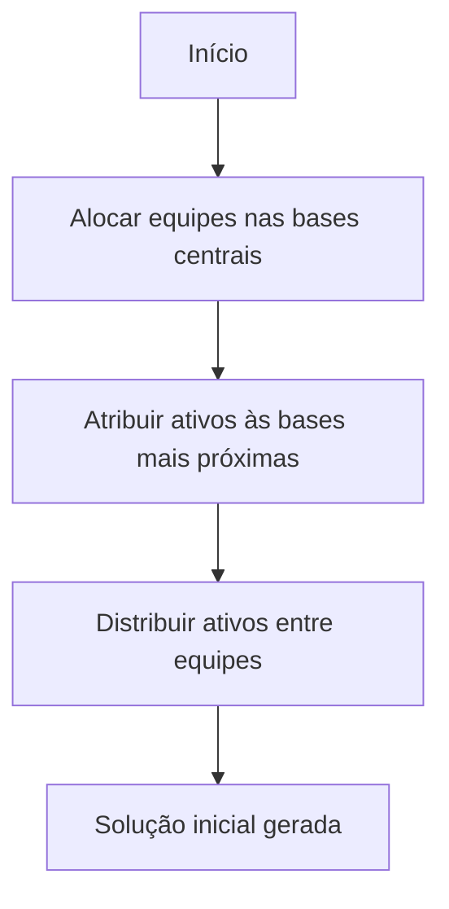

# 🚀 Otimização de Monitoramento de Ativos
## ENTREGA #1: Modelagem Matemática e Otimização Mono-Objetivo

[](https://python.org)
[](LICENSE)
[]()

> **Algoritmo VNS para otimização de alocação de equipes de manutenção em bases estratégicas**

---

## 📋 **Visão Geral**

Este projeto implementa uma solução de otimização para o problema de **monitoramento de ativos** utilizando a metaheurística **VNS (Variable Neighborhood Search)**. O objetivo é encontrar a melhor distribuição de equipes de manutenção entre bases disponíveis, considerando dois critérios conflitantes:

- 🎯 **F1**: Minimizar distância total entre ativos e bases
- 👥 **F2**: Minimizar número de equipes empregadas

### **Problema Real**
Imagine uma empresa com **125 equipamentos** espalhados por uma região, **14 bases** disponíveis e capacidade para contratar até **8 equipes** de manutenção. Como organizar tudo de forma eficiente?

**O conflito**: Usar poucas equipes economiza dinheiro, mas aumenta distâncias. Usar muitas equipes reduz distâncias, mas aumenta custos.

---

## 📐 **Modelagem Matemática**

### **Otimização do Monitoramento de Ativos**

**Objetivo:**
```
min f₁ = Σᵢ₌₁ⁿ Σⱼ₌₁ᵐ dᵢⱼ xᵢⱼ
min f₂ = max_k(Σᵢ hᵢₖ) - min_k(Σᵢ hᵢₖ)
```

**Sujeito a:**
```
Σⱼ₌₁ᵐ yⱼₖ = 1,                    ∀k ∈ {1, ..., s}
Σⱼ₌₁ᵐ xᵢⱼ = 1,                    ∀i ∈ {1, ..., n}
xᵢⱼ ≤ yⱼₖ,                       ∀i ∈ {1, ..., n}, ∀j ∈ {1, ..., m}, ∀k ∈ {1, ..., s}
Σₖ₌₁ˢ hᵢₖ = 1,                    ∀i ∈ {1, ..., n}
hᵢₖ ≤ (xᵢⱼ + yⱼₖ)/2,              ∀i ∈ {1, ..., n}, ∀j ∈ {1, ..., m}, ∀k ∈ {1, ..., s}
Σᵢ₌₁ⁿ hᵢₖ ≥ η · n/s,              ∀k ∈ {1, ..., s}
```

**Parâmetros:**
- **n = 125**: Número de ativos
- **m = 14**: Número de bases
- **s = 8**: Número máximo de equipes
- **η = 0.2**: Percentual mínimo de ativos por equipe
- **dᵢⱼ**: Distância entre ativo i e base j

**Variáveis:**
- **xᵢⱼ ∈ {0,1}**: Ativo i atribuído à base j
- **yⱼₖ ∈ {0,1}**: Base j ocupada pela equipe k
- **hᵢₖ ∈ {0,1}**: Ativo i mantido pela equipe k

---

## 🧠 **Algoritmo VNS**

### **Estrutura de Vizinhança**

| Estrutura | Descrição | Objetivo |
|-----------|-----------|----------|
| **Troca Ativo de Base** | Move equipamento entre bases | Reduzir distâncias |
| **Troca Equipe de Base** | Move equipe entre bases | Reorganizar cobertura |
| **Troca Ativo Entre Equipes** | Troca equipamentos na mesma base | Balancear carga de trabalho |

### **Heurística Construtiva**



### **Estratégia de Refinamento**

- **Busca Local Especializada** para F1 e F2
- **Shake Adaptativo** com intensidade variável
- **Critério de Aceitação** apenas soluções melhores
- **Mecanismo de Restart** para evitar estagnação

---

## 🚀 **Instalação e Execução**

### **Pré-requisitos**

```bash
pip install numpy matplotlib networkx pandas
```

### **Estrutura do Projeto**

```
TC1-final/
├── 📁 src/
│   ├── 🐍 monitoramento_ativos_base.py         # Classe principal e inicialização
│   ├── 🐍 dados.py                             # Carregamento e processamento de dados
│   ├── 🐍 solucoes_iniciais.py                 # Geração de soluções iniciais e heurísticas
│   ├── 🐍 funcoes_objetivo.py                  # Funções objetivo e verificação de restrições
│   ├── 🐍 busca_local.py                       # Estruturas de vizinhança e busca local
│   ├── 🐍 algoritmos_vns.py                    # Algoritmos VNS e otimização
│   ├── 🐍 visualizacao.py                      # Visualização e plotagem
│   ├── 🐍 relatorios.py                        # Relatórios e análise
│   └── 🐍 __init__.py                          # Inicialização do pacote
├── 📁 data/
│   └── 📊 probdata.csv                         # Dados do problema
├── 📁 resultados/
│   ├── 📁 graficos/                            # Gráficos gerados
│   └── 📁 relatorios/                          # Relatórios detalhados
└── 📄 README.md                                # Este arquivo
```

### **Execução do Sistema Modularizado**

```bash
cd TC1-final
python src/monitoramento_ativos_base.py
```

### **Execução de Módulos Específicos**

```bash
# Para testar apenas o carregamento de dados
python -c "from src.dados import DadosProcessor; dp = DadosProcessor('data/probdata.csv'); print(f'Dados carregados: {dp.n_ativos} ativos')"

# Para testar apenas as funções objetivo
python -c "from src.funcoes_objetivo import FuncoesObjetivo; print('Módulo de funções objetivo carregado')"
```

---

## 🏗️ **Arquitetura Modular**

### **Módulos do Sistema**

| Módulo | Responsabilidade | Linhas | Descrição |
|--------|------------------|--------|-----------|
| `monitoramento_ativos_base.py` | Classe principal | ~100 | Orquestração geral e função main |
| `dados.py` | Processamento de dados | ~100 | Carregamento CSV e cálculo de distâncias |
| `solucoes_iniciais.py` | Heurísticas construtivas | ~150 | Geração de soluções iniciais |
| `funcoes_objetivo.py` | Avaliação e restrições | ~80 | F1, F2 e verificação de viabilidade |
| `busca_local.py` | Estruturas de vizinhança | ~400 | Vizinhanças e operadores de shake |
| `algoritmos_vns.py` | Metaheurística VNS | ~200 | Algoritmo principal de otimização |
| `visualizacao.py` | Gráficos e mapas | ~400 | Plotagem de resultados e análises |
| `relatorios.py` | Documentação | ~80 | Geração de relatórios textuais |

### **Vantagens da Modularização**

- ✅ **Manutenibilidade**: Cada módulo tem responsabilidade única
- ✅ **Testabilidade**: Módulos podem ser testados independentemente  
- ✅ **Reutilização**: Componentes podem ser reutilizados em outros projetos
- ✅ **Legibilidade**: Código mais organizado e fácil de entender
- ✅ **Escalabilidade**: Fácil adicionar novas funcionalidades

---

## 📊 **Saídas Geradas**

### **Gráficos de Análise**

| Arquivo | Descrição | Conteúdo |
|---------|-----------|----------|
| `analise_convergencia_completa.png` | Curvas de convergência | 5 execuções sobrepostas para F1 e F2 |
| `melhor_solucao_f1.png` | Rede otimizada para F1 | Distribuição focada em distância mínima |
| `melhor_solucao_f2.png` | Rede otimizada para F2 | Distribuição focada em balanceamento |

### **Relatórios**

- **`relatorio_entrega_1.txt`**: Estatísticas completas (min, max, média, desvio)
- **Console**: Log detalhado da execução em tempo real

---

## 🎯 **Características Técnicas**

### **Algoritmo VNS Implementado**

- ✅ **Exploração Diversificada**: Múltiplas estruturas de vizinhança
- ✅ **Busca Local Inteligente**: Estratégias específicas para cada função objetivo
- ✅ **Adaptabilidade**: Intensidade de perturbação ajustável
- ✅ **Robustez**: Mecanismo de restart para evitar estagnação

### **Otimizações Específicas**

**Para F1 (Distância):**
- Foco em redução de distâncias totais
- Movimentação estratégica de ativos
- Análise de proximidade espacial

**Para F2 (Diferença entre Equipes):**
- Consolidação de equipes
- Remoção de equipes vazias
- Balanceamento de carga de trabalho

---

## 📈 **Resultados Esperados**

### **Função F1 (Distância Total)**
- **Objetivo**: Minimizar soma de distâncias
- **Unidade**: Quilômetros
- **Interpretação**: Menor valor = maior eficiência espacial

### **Função F2 (Diferença entre Equipes)**
- **Objetivo**: Minimizar diferença entre equipes
- **Unidade**: Diferença em número de ativos
- **Interpretação**: Menor valor = maior balanceamento

### **Conflito Identificado**
As funções F1 e F2 são **conflitantes**:
- **F1 baixo** → F2 alto (muitas equipes próximas, distâncias pequenas)
- **F2 baixo** → F1 alto (poucas equipes, distâncias grandes)

---

## 🎨 **Visualizações**

### **Gráfico de Rede**
- 🔴 **Pentágonos pretos com cruz**: Bases ocupadas (com equipes)
- ⚪ **Pentágonos brancos**: Bases disponíveis (sem equipes)
- 🔵 **Círculos azuis**: Ativos (equipamentos)
- ➖ **Linhas**: Conexões ativo-base

### **Curvas de Convergência**
- **Eixo X**: Número de iterações
- **Eixo Y**: Valor da função objetivo
- **5 curvas**: Uma para cada execução estocástica

---

## 📚 **Requisitos da ENTREGA #1**

### **✅ Formulação Matemática**
- [x] Parâmetros do problema
- [x] Variáveis de decisão
- [x] Funções objetivo (F1 e F2)
- [x] Restrições do problema

### **✅ Algoritmo de Solução**
- [x] Metaheurística VNS adequada
- [x] Modelagem computacional
- [x] 3+ estruturas de vizinhança
- [x] Heurística construtiva
- [x] Estratégia de refinamento

### **✅ Resultados da Otimização**
- [x] Algoritmo implementado e funcionando
- [x] 5 execuções estocásticas
- [x] Curvas de convergência sobrepostas
- [x] Figuras das melhores soluções

---

## 🤝 **Contribuição**

Este projeto foi desenvolvido para a disciplina de **Teoria da Decisão** como parte da ENTREGA #1. O código está otimizado para demonstração acadêmica e pode ser adaptado para problemas similares de otimização logística.

### **Próximos Passos Sugeridos**
1. Implementar otimização multi-objetivo
2. Adicionar análise de sensibilidade
3. Expandir para problemas de maior escala
4. Integrar com sistemas de gestão empresarial

---

## 📄 **Licença**

Este projeto está sob a licença MIT. Veja o arquivo [LICENSE](LICENSE) para mais detalhes.

---

## 👨‍💻 **Autor**

Desenvolvido para a disciplina de **Teoria da Decisão** - ENTREGA #1

---

<div align="center">

**⭐ Se este projeto foi útil, considere dar uma estrela! ⭐**

</div>